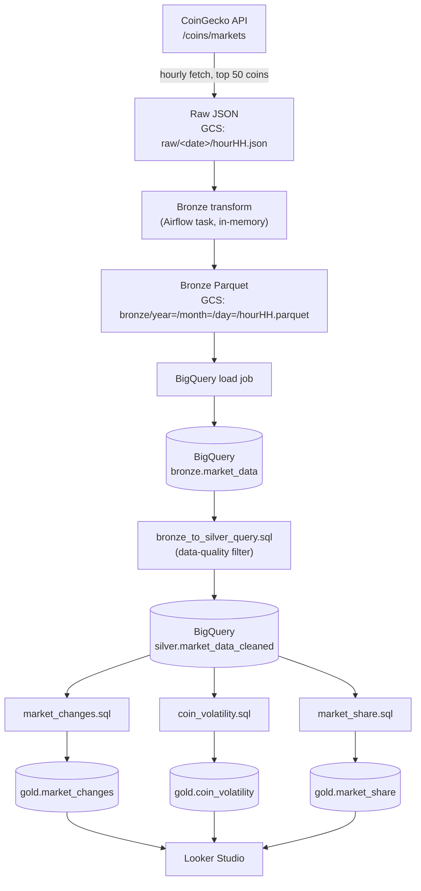

# Crypto Market Data Pipeline

An hourly data pipeline that ingests cryptocurrency market data from the [CoinGecko API](https://www.coingecko.com/en/api), processes it through a medallion (Bronze/Silver/Gold) architecture on Google Cloud, and exposes analytics-ready tables that power a set of Looker Studio dashboards.

Built as a portfolio project to demonstrate an end-to-end batch data pipeline: orchestration with Airflow, cloud storage staging, SQL-based transformation in BigQuery, and a self-serve BI layer on top.

---

## 1. What this project does

Every hour, the pipeline pulls a snapshot of the top 50 cryptocurrencies by market cap (price, market cap, rank, volume, circulating supply, ATH, etc.) and lands it through three progressively cleaner layers:

- **Bronze** — typed, renamed, deduplicated-by-field snapshot of the raw API response.
- **Silver** — the same records, with a data-quality filter applied (no nulls/negative values in required fields, timestamp sanity-checked against the DAG's execution window).
- **Gold** — three analytics tables built with pure SQL on top of Silver:
  - `market_changes` — hour-over-hour deltas in price, market cap and rank per coin.
  - `coin_volatility` — 24h market-cap volatility (stddev of hourly returns) per coin.
  - `market_share` — each coin's share of the total market cap of the tracked set, per snapshot.

These Gold tables are queried directly by **Looker Studio** to answer questions like:

- Which coins are the most volatile?
- How concentrated is the market among the top coins?

## 2. Architecture

### 2.1 Data flow



### 2.2 Orchestration

Two Airflow DAGs, deployed to **Cloud Composer**:

- **`setup_crypto_infra`** — run once (`schedule=None`). Provisions the GCS bucket and the `bronze` / `silver` / `gold` BigQuery datasets and tables. Kept separate from the recurring pipeline so that infrastructure provisioning isn't accidentally re-run or coupled to every hourly execution.
- **`crypto_dag`** — runs `@hourly`. Fetches the top coins, uploads raw JSON, transforms to Bronze Parquet, loads it into BigQuery, then chains three in-BigQuery SQL jobs to build Bronze → Silver → Gold:

  ```
  fetch_top_coins → fetch_and_upload_market_data → bronze_transform_and_upload
      → load_bronze_to_bigquery → bronze_to_silver
      → market_changes → coin_volatility → market_share
  ```

### 2.3 Trade-offs

**SQL-based Silver/Gold transforms (ELT) vs. transforming in Python.**
Silver and Gold logic live entirely in `.sql` files run as `BigQueryInsertJobOperator` query jobs, rather than as pandas transforms on Airflow workers. This pushes the actual computation onto BigQuery's engine (better suited to aggregations/window functions at scale) and keeps Airflow workers stateless and cheap. The cost is that the transformation logic is now tied to BigQuery's SQL dialect rather than portable Python, and testing it requires a live BigQuery connection rather than pure unit tests.

**Medallion architecture (Bronze/Silver/Gold) vs. writing directly to one analytics table.**
Three layers means more storage and more jobs than landing directly into Gold. In exchange: Raw/Bronze preserve exactly what the API returned (auditable, reprocessable if a downstream bug is found), Silver enforces one data-quality gate in a single place, and Gold stays purely additive/query-only. For a project of this size a single-table approach would be simpler to run, but wouldn't demonstrate (or support) the reprocessing/auditability guarantees.

**Table partitioning.** All BigQuery tables are day-partitioned on `snapshot_ts`, so time-scoped queries (e.g. "last 24h volatility") scan only the relevant partitions instead of the full table.

### 2.4 Error handling

- API calls (`src/extract.py`) retry up to 3 times with exponential backoff on `429/500/502/503/504`.
- If the top-coins list or the market-data fetch comes back empty, the Airflow task raises `AirflowException` and fails loudly rather than silently writing partial/empty data downstream.
- The Silver filter drops any record with a null or out-of-range required field, so bad data never reaches Gold — but is also never repaired, only excluded.

## 3. Repository structure

```
airflow/dags/
├── crypto_daily.py        # Hourly pipeline DAG (crypto_dag)
├── setup_crypto_infra.py  # One-time infra provisioning DAG
├── src/
│   ├── configs.py         # Project/bucket IDs, BQ schemas & job configs, SQL loading
│   ├── extract.py         # CoinGeckoAPI client (retries, top-coins + market-data fetch)
│   ├── transform.py       # Raw → Bronze field mapping/typing
│   └── utils.py           # Small file helpers
└── sql/
    ├── bronze_to_silver_query.sql
    ├── market_changes.sql
    ├── coin_volatility.sql
    └── market_share.sql
docs/schemas/               # Schema reference docs for every layer (Raw → Gold)
deploy_dags.sh               # Syncs airflow/dags/ to a Cloud Composer bucket
```

Schema-level documentation for every table (Raw, Bronze, Silver, and each Gold table) lives in [`docs/schemas/`](docs/schemas/).

## 4. Running it locally

### Prerequisites

- Python 3.12
- A GCP project with the **BigQuery** and **Cloud Storage** APIs enabled
- A service account key (`credentials.json`) with permissions to create/write GCS buckets and BigQuery datasets/tables/jobs
- A [CoinGecko Demo API key](https://www.coingecko.com/en/api/pricing) (free tier)

### Setup

```bash
git clone <this-repo-url>
cd crypto-analysis

python3.12 -m venv .venv
source .venv/bin/activate
pip install -r requirements.txt
```

Update `airflow/dags/src/configs.py` with your own `PROJECT_ID` and `BUCKET_NAME` (bucket names must be globally unique on GCS), and place your service account key at the path you'll reference below.

Point Airflow at this repo's DAGs and initialize it:

```bash
export AIRFLOW_HOME="$(pwd)/airflow"
airflow db migrate
```

Set the CoinGecko API key as an Airflow Variable, and register a GCP connection Airflow will use for the GCS/BigQuery operators:

```bash
airflow variables set API_KEY "<your-coingecko-api-key>"

airflow connections add google_cloud_default \
    --conn-type google_cloud_platform \
    --conn-extra '{
        "extra__google_cloud_platform__key_path": "/absolute/path/to/credentials.json",
        "extra__google_cloud_platform__project": "<your-gcp-project-id>"
    }'
```

Start Airflow:

```bash
airflow standalone
```

In the Airflow UI (`http://localhost:8080`):

1. Trigger **`setup_crypto_infra`** once — it creates the GCS bucket and the `bronze`/`silver`/`gold` BigQuery datasets and tables.
2. Unpause **`crypto_dag`** — it will start running on its hourly schedule (or trigger it manually to test immediately).

## 5. Deploying to Cloud Composer (GCP)

This project assumes you already have a Cloud Composer environment provisioned (Composer manages Airflow itself; this repo only supplies the DAGs).

1. Open `deploy_dags.sh` and set `COMPOSER_BUCKET` to your environment's DAGs bucket (found in the Composer environment details, e.g. `gs://<region>-<env-name>-bucket`):

   ```bash
   COMPOSER_BUCKET="gs://<your-composer-bucket>"
   ```

2. Authenticate with `gcloud` / `gsutil` against the target GCP project, then sync the DAGs:

   ```bash
   ./deploy_dags.sh
   ```

   The script runs `gsutil rsync` from `airflow/dags/` into `<COMPOSER_BUCKET>/dags`, excluding `__pycache__` and `.pyc` files, so it's safe to re-run on every change — it only pushes the diff.

3. In the Composer environment's Airflow UI, configure the same two prerequisites as local setup:
   - Admin → Variables: `API_KEY` = your CoinGecko API key.
   - Admin → Connections: `google_cloud_default` (Composer environments typically already have a working default GCP connection via the environment's service account — only override this if you need a different identity/project than the one Composer runs under).

4. Trigger **`setup_crypto_infra`** once, then unpause **`crypto_dag`**.

## 6. Visualization

The three Gold tables (`gold.market_changes`, `gold.coin_volatility`, `gold.market_share`) are connected directly to **Looker Studio** via the BigQuery connector, with no intermediate export step — dashboards query BigQuery live, so they reflect the latest hourly run automatically.

## 7. Tech stack

| Layer | Tooling |
|---|---|
| Orchestration | Apache Airflow (Cloud Composer) |
| Storage | Google Cloud Storage (Raw JSON, Bronze Parquet) |
| Warehouse / transforms | BigQuery (SQL-based Bronze → Silver → Gold) |
| Ingestion | Python (`requests`, with retry/backoff), CoinGecko REST API |
| BI | Looker Studio |
